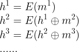
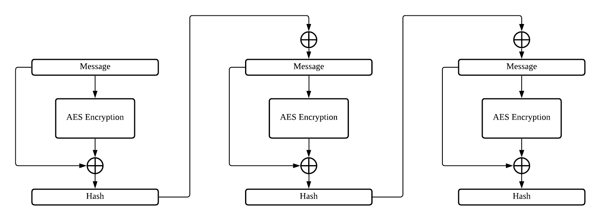
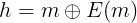
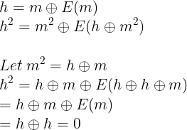
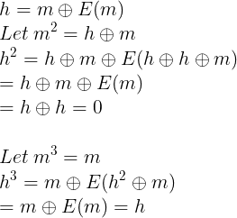

# Help a Santa helper? (Crypto)
Description:
```
Hey, I found some secret server on which Krampus stores his private details.
It seems like he has some kind of difficult crypto challenge instead of a login, if we pass that we should get access to valuable information.
Let's give it a try, what do you say?

Target: nc challs.xmas.htsp.ro 1004
Author: Gabies
```
Files:
- [server.py](server.py)
- [chall.py](chall.py)
- [PoW.py](PoW.py)

Try to netcat in, same as last crypto chall, ask for a hash:
```
Provide a hex string X such that sha256(unhexlify(X))[-5:] = 88976

```
Using the same pwntools script:
```py
from pwn import *
p = remote("challs.xmas.htsp.ro" ,1004)
p.recvuntil("= ")
h = p.recvuntil("\n")[:-1]
ans = pwnlib.util.iters.mbruteforce(lambda x: hashlib.sha256(x.encode()).hexdigest()[-5:] == h.decode() , string.ascii_lowercase, length = 10)
p.sendline(ans.encode().hex())
```
Result:
```
python3 solve.py 
[+] Opening connection to challs.xmas.htsp.ro on port 1004: Done
[+] MBruteforcing: Found key: "byytn"
[*] Switching to interactive mode

Good, you can continue!
Hello, thanks for answering my call, this time we have to break into Krampus' server and recover a stolen flag.
We have to solve a hash collision problem to get into the server.
Sadly, we're on a hurry and you only have 2 actions you can make until we get detected.
Choose what you want to do:
1. hash a message
2. provide a collision
3. exit

$ 1
Ok, give me a hex-encoded string to hash.

Give me a message.
$ deadbeef
Here is your hash: b'b01385bb41ec9d0956545c328a5160ae'.

Choose what you want to do:
1. hash a message
2. provide a collision
3. exit

$ 2
Now give me two different hex-encoded strings to check for a collision.

Give me a message.
$ deadbeef
Give me a message.
$ deadbeef
Oh, you silly, that was not it, you should try one more time!
[*] Got EOF while reading in interactive

```
As you can see, we can only have two actions:
1. hash a message
2. provide a collision

## Analyse source code
### server.py
```py
from chall import *
from PoW import *
from text import *
import os
from binascii import *

def is_hex(s):
    for c in s:
        if not c in "0123456789abcdef":
            return False
    return True

def collision(h1, h2):
    return h1.string != h2.string and h1.digest() == h2.digest()

if not PoW(5):
    exit()

action_cnt = 2
seed = os.urandom(16)

print (intro.format(action_cnt))

for i in range(action_cnt):
    print (menu)
    x = input()

    if not x in ["1", "2", "3"]:
        print(invalid_input)
        exit()

    if x == "1":
        print (hash_message)
        print (get_msg)
        msg = input()

        if not is_hex(msg):
            print (bad_input)
            exit()

        h = Hash(seed)
        h.update(unhexlify(msg))

        print (show_hash.format(h.hexdigest()))

    if x == "2":
        print (collision_message)

        print (get_msg)
        msg1 = input()
        
        print (get_msg)
        msg2 = input()

        if not (is_hex(msg1) and is_hex(msg2)):
            print (bad_input)
            exit()

        h1 = Hash(seed)
        h2 = Hash(seed)

        h1.update(unhexlify(msg1))
        h2.update(unhexlify(msg2))

        if (collision(h1, h2)):
            print (win.format(FLAG))
        else:
            print (lose)
            exit()
    
    if x == "3":
        print (goodbye)
        exit()
```

After looking the server.py, we know that `seed` is generate randomly, and we can get the flag only if `collision` return true

```py
def collision(h1, h2):
    return h1.string != h2.string and h1.digest() == h2.digest()
...
...
h1 = Hash(seed)
h2 = Hash(seed)

h1.update(unhexlify(msg1))
h2.update(unhexlify(msg2))

if (collision(h1, h2)):
    print (win.format(FLAG))
```

### chall.py
```py
import os
from Crypto.Cipher import AES
from binascii import hexlify

def xor(a, b):
    return bytes([x^y for x,y in zip(a, b)])

def pad(msg, block_size):
    if len(msg) % block_size == 0:
        return msg
    return msg + bytes(block_size - len(msg) % block_size)

class Hash:
    def __init__(self, seed = None):
        if seed == None:
            seed = os.urandom(16)

        self.perm = AES.new(seed, AES.MODE_ECB)
        self.get_elem = self.perm.encrypt
        self.hash = bytes(16)
        self.string = b""

    def update(self, msg):
        msg = pad(msg, 16)
        for i in range(0, len(msg), 16):
            self.string += msg[i:i+16]
            self.hash = xor(msg[i:i+16], self.get_elem(xor(self.hash, msg[i:i+16])))

    def digest(self):
        return self.hash

    def hexdigest(self):
        return hexlify(self.digest())

```
After looking the chall.py, we know it is using **AES ECB** to encrypt our message

But the `update` function does some special things:
```py
def update(self, msg):
    msg = pad(msg, 16)
    for i in range(0, len(msg), 16):
        self.string += msg[i:i+16]
        self.hash = xor(msg[i:i+16], self.get_elem(xor(self.hash, msg[i:i+16])))
```
We know the `get_elem` is the AES ECB encrypt function

And the `hash` is always 16 bytes, because it not appending

It does something like this if written in math term:



Where `m` is message, h is `hash`, E is `get_elem` 

If convert to diagram is something like this:



## Finding the collision

In the `collision` function, state that **we need to give two different message but produce the same hash**

We can only hash a message once then we need to provide the two message. (Because of max 2 actions)

There is a flaw exist in this custom made hashing

If we send a only 16 bytes message, it return the hash that is message XOR the encrypted message:



Then what happen if we send `h XOR m` for the 2nd block of the message?



As you can see, if we put the 2nd block message as hash XOR message, it must produce hash with all zero!

So we give `m` for first message and `m+(h^m)+m` for second message to get the collision!

Because `m` produce `h`, `m+(h XOR m)+m` also produce `h` (0 XOR h = h), so we get different message but same hash!



## Solving
Written a [python script](solve.py) to solve this:
```py
from pwn import *
# Pad function from the chall.py
def pad(msg, block_size):
	if len(msg) % block_size == 0:
		return msg
	return msg + bytes(block_size - len(msg) % block_size)

p = remote("challs.xmas.htsp.ro" ,1004)
p.recvuntil("= ")
h = p.recvuntil("\n")[:-1]
ans = pwnlib.util.iters.mbruteforce(lambda x: hashlib.sha256(x.encode()).hexdigest()[-5:] == h.decode() , string.ascii_lowercase, length = 10)
p.sendline(ans.encode().hex())

p.sendline('1')
p.sendlineafter("message.\n","SKR".encode().hex())
p.recvuntil("Here is your hash: b'")
h = bytes.fromhex(p.recvuntil("'")[:-1].decode())
m = pad(b"SKR",16)
hm = xor(m,h)
p.sendline('2')
p.sendlineafter("message.\n",(m).hex())
p.sendlineafter("message.\n",(m+hm+m).hex())
p.interactive()
```
And we got the flag!!
```
python3 solve.py 
[+] Opening connection to challs.xmas.htsp.ro on port 1004: Done
[+] MBruteforcing: Found key: "tgao"
[*] Switching to interactive mode
Damn, that was a really clever approach, you should be proud of yourself.
Here's the flag: X-MAS{C0l1i5ion_4t7ack5_4r3_c0o1!_4ls0_ch3ck_0u7_NSUCRYPTO_fda233}
[*] Got EOF while reading in interactive

```
## Flag
> X-MAS{C0l1i5ion_4t7ack5_4r3_c0o1!_4ls0_ch3ck_0u7_NSUCRYPTO_fda233}