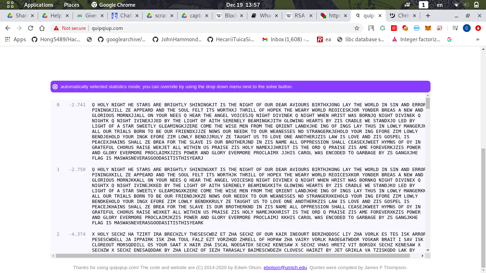

# Scrambled Carol (Crypto)
Description:
> I downloaded this carol a few days ago, and then I started reverse engineering some malware... Somehow my carol got scrambled after that, and next to it appeared some sort of weird script.

> Can you help me recover the carol? It was a very good one.

> Note: Challenge does not follow the normal flag format. Upload as lowercase.

> Author: Gabies

Files:
- [script.py](script.py)
- [output.txt](output.txt)

We're given two files only

`script.py`:
```py
import os
import random

def get_seed(size):
    return int(os.urandom(size).hex(), 16)

input_data = None
output_data = ""

seed = get_seed(4)
random.seed(seed)

old_sigma = "0123456789abcdef"
new_sigma = list(old_sigma)
random.shuffle(new_sigma)
new_sigma = ''.join(new_sigma)
print(old_sigma, new_sigma)

with open("input.txt", "r") as in_file:
    input_data = in_file.read()

for alpha in input_data:
    encoded = (bytes(alpha.encode()).hex())
    output_data += new_sigma[old_sigma.index(encoded[0])]
    output_data += new_sigma[old_sigma.index(encoded[1])]

with open("output.txt", "w") as out_file:
    out_file.write(str(output_data))
```

`output.txt`:
```
3b180e0b05d71802070d0e... (a long hex string)
```

The script convert the `input.txt` into hex, then it map the hex value using `new_sigma` which random shuffled `0123456789abcdef` string

We can't reverse the shuffle, but we can **analyse the ciphertext frequency!**

By using [Frequency Analysis](https://en.wikipedia.org/wiki/Frequency_analysis), we can recover the plaintext!

Because the `output.txt` is very long, so it must have many sentences. 

**Each letter produce the same hex value**, so we can use this technique

I used the letter frequency in this [website](https://inventwithpython.com/hacking/chapter20.html)

Then use python to script it:
```py
text = open("output.txt",'r').read().decode('hex')
freq = sorted(set(text), key = text.count)[::-1]

englishLetterFreq = ' ETAOINSHRDLCUMWFGYPBVKJXQZ'
# Map each ciphertext with a letter
mapping = {}
for i,t in enumerate(freq):
	if i < 27:
		mapping[t] = englishLetterFreq[i]

flag = ''
for c in text:
	if c in mapping.keys():
		flag += mapping[c]

print(flag)
```
Result:
```
Z DAHM IOLDR DE NRSTN STE PTOLDRHM NDOIOILKCR ON RDE IOLDR AB AFT UEST SXOAFTN POTRDJCAIL HSM RDE WATHU OI NOI SIU ETTAT VOIOILKCOHH YE SVVESTU SIU RDE NAFH BEHR ORN WATRDJC RDTOHH AB DAVEK RDE WESTM WATHU TEAOQENKCAT MAIUET PTESN S IEW SIU LHATOAFN GATIJCCSHH AI MAFT IEEN Z DEST RDE SILEH XAOQENCZ IOLDR UOXOIEK Z IOLDR WDEI DTONR WSN PATICZ IOLDR UOXOIEK Z IOLDRK Z IOLDR OXOIEJCCEU PM RDE HOLDR AB SORD NETEIEHM PESGOILKCORD LHAWOIL DESTRN PM YON QTSUHE WE NRSIUJCA HEU PM HOLDR AB S NRST NWEERHM LHESGOILKCYETE QAGE RDE WONE GEI BTAG RDE ZTOEIR HSIUJCDE OIL AB OILN HSM RDFN OI HAWHM GSILETCI SHH AFT RTOSHN PATI RA PE AFT BTOEIUJCCYE IAWN AFT IEEUK RA AFT WESIENNEN IA NRTSILETKCEDAHU MAFT OIL EBATE YOG HAWHM PEIUCEDAHU MAFT OILK EBATE YOG HAWHM PEIUCCTFHM YE RSFLDR FN RA HAXE AIE SIARDETCYON HSW ON HAXE SIU YON LANVEH ON VESQEJCDSOIN NDSHH YE PTES BAT RDE NHSXE ON AFT PTARDETCIU OI YON ISGE SHH AVVTENNOAI NDSHH QESNEJCWEER DMGIN AB AM OI LTSREBFH QDATFN TSONE WEKCER SHH WORDOI FN VTSONE YON DAHM ISGEJCCDTONR ON RDE ATU Z VTSONE YON SGE BATEXETKCYON VAWET SIU LHATM EXETGATE VTAQHSOGJCYON VAWET SIU LHATM EXETGATE VTAQHSOGJ CCDON QSTAH WSN EIQAUEU RA LSTPSLE PM YN LSILJCDE BHSL ON GSNWSNIEXETSNLAAUSNORONRDONMESTC
```
As you can see the frequency is not accurate..

But notice a long word `GSNWSNIEXETSNLAAUSNORONRDONMESTC`, this must be the flag!

And last previous words `BHSL ON` should be `FLAG IS`

After changing the script I got:
```
Z DNLM OIGDR DE SRATS ATE PTIGDRLM SDIOIOGKCR IS RDE OIGDR NF NBT UEAT AXINBTS PITRDJCNOG LAM RDE WNTLU IO SIO AOU ETTNT VIOIOGKCILL YE AVVEATU AOU RDE SNBL FELR IRS WNTRDJC RDTILL NF DNVEK RDE WEATM WNTLU TENIQESKCNT MNOUET PTEAS A OEW AOU GLNTINBS HNTOJCCALL NO MNBT OEES Z DEAT RDE AOGEL XNIQESCZ OIGDR UIXIOEK Z OIGDR WDEO DTISR WAS PNTOCZ OIGDR UIXIOEK Z OIGDRK Z OIGDR IXIOEJCCEU PM RDE LIGDR NF AIRD SETEOELM PEAHIOGKCIRD GLNWIOG DEATRS PM YIS QTAULE WE SRAOUJCN LEU PM LIGDR NF A SRAT SWEERLM GLEAHIOGKCYETE QNHE RDE WISE HEO FTNH RDE ZTIEOR LAOUJCDE IOG NF IOGS LAM RDBS IO LNWLM HAOGETCO ALL NBT RTIALS PNTO RN PE NBT FTIEOUJCCYE ONWS NBT OEEUK RN NBT WEAOESSES ON SRTAOGETKCEDNLU MNBT IOG EFNTE YIH LNWLM PEOUCEDNLU MNBT IOGK EFNTE YIH LNWLM PEOUCCTBLM YE RABGDR BS RN LNXE NOE AONRDETCYIS LAW IS LNXE AOU YIS GNSVEL IS VEAQEJCDAIOS SDALL YE PTEA FNT RDE SLAXE IS NBT PTNRDETCOU IO YIS OAHE ALL NVVTESSINO SDALL QEASEJCWEER DMHOS NF NM IO GTAREFBL QDNTBS TAISE WEKCER ALL WIRDIO BS VTAISE YIS DNLM OAHEJCCDTISR IS RDE NTU Z VTAISE YIS AHE FNTEXETKCYIS VNWET AOU GLNTM EXETHNTE VTNQLAIHJCYIS VNWET AOU GLNTM EXETHNTE VTNQLAIHJ CCDIS QATNL WAS EOQNUEU RN GATPAGE PM YS GAOGJCDE FLAG IS HASWASOEXETASGNNUASIRISRDISMEATC
```
Notice alot of `RDE` should be `THE` the most common word

After changing, got closer to the plaintext:
```
Z HNLM OIGHT HE STARS ARE PRIGHTLM SHIOIOGKCT IS THE OIGHT NF NBR UEAR AXINBRS PIRTHJCNOG LAM THE WNRLU IO SIO AOU ERRNR VIOIOGKCILL YE AVVEARU AOU THE SNBL FELT ITS WNRTHJC THRILL NF HNVEK THE WEARM WNRLU RENIQESKCNR MNOUER PREAS A OEW AOU GLNRINBS DNROJCCALL NO MNBR OEES Z HEAR THE AOGEL XNIQESCZ OIGHT UIXIOEK Z OIGHT WHEO HRIST WAS PNROCZ OIGHT UIXIOEK Z OIGHTK Z OIGHT IXIOEJCCEU PM THE LIGHT NF AITH SEREOELM PEADIOGKCITH GLNWIOG HEARTS PM YIS QRAULE WE STAOUJCN LEU PM LIGHT NF A STAR SWEETLM GLEADIOGKCYERE QNDE THE WISE DEO FRND THE ZRIEOT LAOUJCHE IOG NF IOGS LAM THBS IO LNWLM DAOGERCO ALL NBR TRIALS PNRO TN PE NBR FRIEOUJCCYE ONWS NBR OEEUK TN NBR WEAOESSES ON STRAOGERKCEHNLU MNBR IOG EFNRE YID LNWLM PEOUCEHNLU MNBR IOGK EFNRE YID LNWLM PEOUCCRBLM YE TABGHT BS TN LNXE NOE AONTHERCYIS LAW IS LNXE AOU YIS GNSVEL IS VEAQEJCHAIOS SHALL YE PREA FNR THE SLAXE IS NBR PRNTHERCOU IO YIS OADE ALL NVVRESSINO SHALL QEASEJCWEET HMDOS NF NM IO GRATEFBL QHNRBS RAISE WEKCET ALL WITHIO BS VRAISE YIS HNLM OADEJCCHRIST IS THE NRU Z VRAISE YIS ADE FNREXERKCYIS VNWER AOU GLNRM EXERDNRE VRNQLAIDJCYIS VNWER AOU GLNRM EXERDNRE VRNQLAIDJ CCHIS QARNL WAS EOQNUEU TN GARPAGE PM YS GAOGJCHE FLAG IS DASWASOEXERASGNNUASITISTHISMEARC
```
I lazy to do this manually, so I use [quiqqiup](http://quipqiup.com/) to help me solve it!



By googling, you can find this is a [chrismas song lyrics!](https://genius.com/Christmas-songs-o-holy-night-lyrics)

## Flag
> xmaswasneverasgoodasitisthisyear